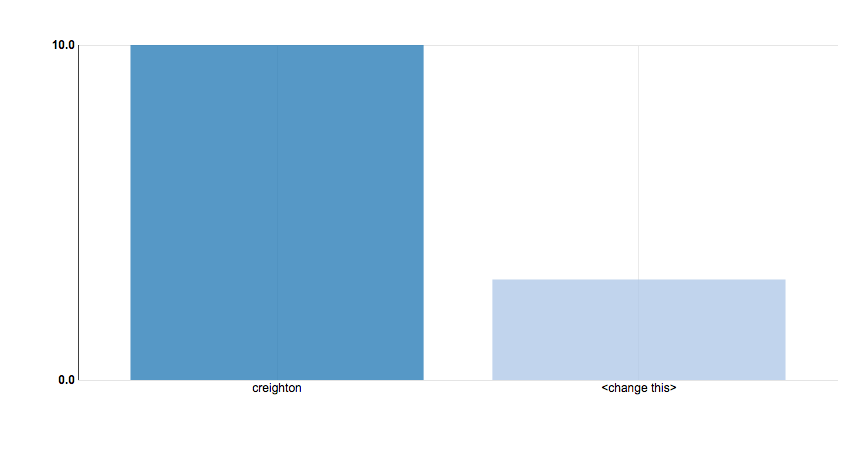
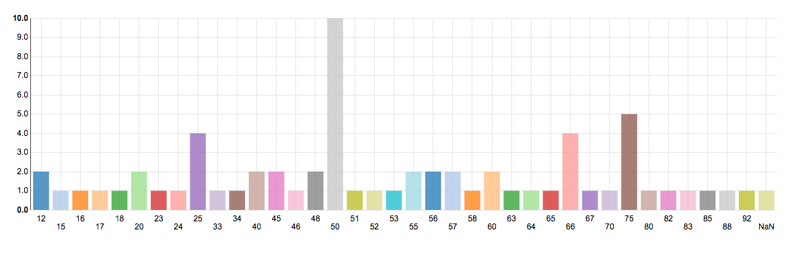

# Hands On Reporting
Welcome to the hands on portion of the session. The following are some challenges to highlight ADL's Dashboard and Collection libraries, while giving you exposure to working with statements. The xAPI Dashboard is included in the GitHub project for your use, or download the dashboard files [here](https://github.com/adlnet/xAPI-Dashboard/releases/tag/v1.2.1).
## Bar Chart of Users Attempt Count



## Bar Chart of the Frequency a Number is Guessed



## Extra Challenges
The following challenges gives you the chance to gain more experience querying the LRS and filtering statements. We used the [xAPI Collection](https://github.com/adlnet/xAPI-Dashboard/blob/master/API_collection.md) module, but you may use any process you want. 
#### List the players of ‘guess the number’  
  __Output:__  
  ```javascript  
  [
    {
        "player": "creighton"
    },
    {
        "player": "Pj"
    },
    {
        "player": "<change this>"
    }
  ]
  ```  
    
    
#### List the players and average number of guesses to get the number  
  __Output:__  
  ```javascript
  [
    {
        "name": "creighton",
        "average": 6.5
    },
    {
        "name": "<change this>",
        "average": 5.666666666666667
    }
  ]
  ```  
    
    
#### Display the statement of the longest game played  
  __Output:__  
  ```javascript
  {
    "verb": {
        "id": "http://adlnet.gov/event/2015/xapibootcamp/verb/ended",
        "display": {
            "en-US": "ended"
        }
    },
    "version": "1.0.1",
    "timestamp": "2015-07-02T18:17:05.985Z",
    "object": {
        "definition": {
            "type": "http://adlnet.gov/event/2015/xapibootcamp/activity/type/game",
            "name": {
                "en-US": "Guess the Number Game"
            },
            "description": {
                "en-US": "Simple guess the number game to demonstrate xAPI"
            }
        },
        "id": "http://adlnet.gov/event/2015/xapibootcamp/guess-the-number",
        "objectType": "Activity"
    },
    "actor": {
        "account": {
            "homePage": "http://adlnet.gov/accounts",
            "name": "creighton"
        },
        "objectType": "Agent"
    },
    "stored": "2015-07-02T18:09:09.533813+00:00",
    "result": {
        "extensions": {
            "http://adlnet.gov/event/2015/xapibootcamp/guess-the-number/ext/endedAt": "2015-07-02T18:17:05.985Z",
            "http://adlnet.gov/event/2015/xapibootcamp/guess-the-number/ext/number": 92,
            "http://adlnet.gov/event/2015/xapibootcamp/guess-the-number/ext/min": 1,
            "http://adlnet.gov/event/2015/xapibootcamp/guess-the-number/ext/max": 100,
            "http://adlnet.gov/event/2015/xapibootcamp/guess-the-number/ext/guesses": [
                50,
                92
            ],
            "http://adlnet.gov/event/2015/xapibootcamp/guess-the-number/ext/startedAt": "2015-07-02T18:12:14.037Z"
        }
    },
    "context": {
        "registration": "da238e77-eb5c-4c4d-9d57-9f36d46237db",
        "contextActivities": {
            "category": [
                {
                    "id": "http://adlnet.gov/event/2015/xapibootcamp"
                }
            ],
            "grouping": [
                {
                    "id": "http://adlnet.gov/event/2015/xapibootcamp/dev/web"
                }
            ]
        }
    },
    "id": "c21847ab-aa7a-438e-bb07-81c016a48f43",
    "authority": {
        "mbox": "mailto:tom@example.com",
        "name": "tom",
        "objectType": "Agent"
    }
  }
  ```  
    
    
#### List the players and total time playing the game  
  __Output:__  
  ```javascript
  [
    {
        "player": "creighton",
        "totaltime": 457774
    },
    {
        "player": "<change this>",
        "totaltime": 48374
    }
  ]
  ```  
    
    
#### Group the SCORM to xAPI statements by posttest (activity id: http://adlnet.gov/courses/roses/posttest) test scores  
  __Output:__  
  ```javascript
  [
    {
      "group": "0.25",
      "data": [statements...]
    },
    {
      "group": "0.5",
      "data": [statements...]
    },
    ...
  ]
  ```  
    
    
#### Group the VW Sandbox statements by registration UUID  
  __Output:__  
  ```javascript
    [
      {
        "group": <the registration uuid>,
        "data": [statements...]
      },
      ...
    ]
  ```  
    
    
#### Display the most used verb in the LRS in the past 2 weeks  
  __Output:__  
  ```javascript
  [
    {
        "verbID": "http://adlnet.gov/xapi/verbs/passed(to_go_beyond)",
        "count": 552
    }
  ]
  ```  
    
    
#### Display the most used activity in the LRS in the past 2 weeks  
  __Output:__  
  ```javascript
  [
    {
        "activityID": "act:adlnet.gov/JsTetris_XAPI",
        "count": 247
    }
  ]
  ```  
  
